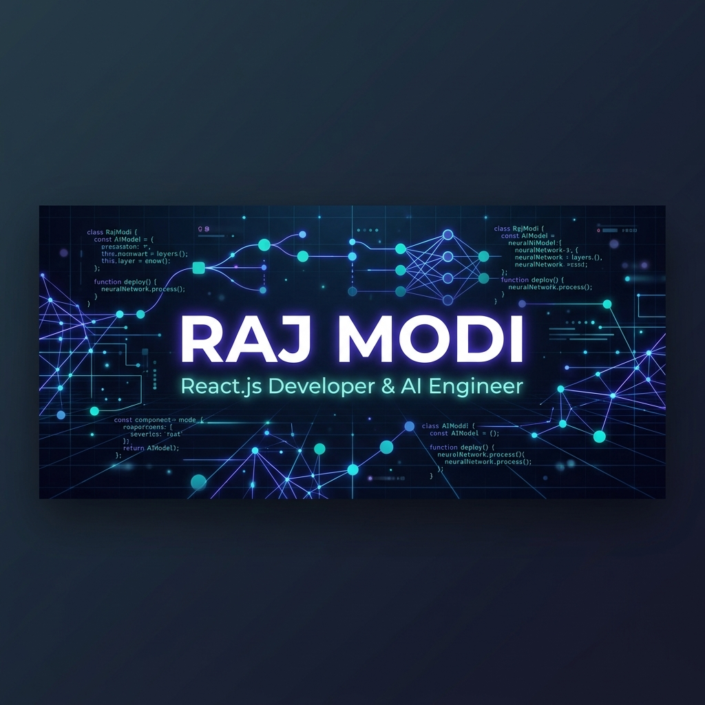

<div align="center">
  
</div>

<br>

<div align="center">
  <a href="https://git.io/typing-svg">
    
  </a>
</div>

<div align="center">
  <h3>⚡ Frontend Developer & AI Systems Architect ⚡</h3>
  <p><em>Fusing advanced React.js interfaces with cognitive multi-agent AI networks.</em></p>
</div>

<div align="center">
  <a href="mailto:rajmodi262@gmail.com">
    
  </a>
  <a href="https://linkedin.com/in/rajmodi2004/">
    
  </a>
  <a href="https://github.com/rajmodi262">
    
  </a>
</div>

<br>

---

## 🛰️ System Specifications
```yaml
Core Engine:
  Status: OPERATIONAL 🟢
  Focus: High-performance React SPAs, WebSockets, Visual Strategy Builders
  Primary Stack: React.js, Next.js 14, TypeScript, Zustand, Tailwind CSS, FastAPI
  Data Engine: REST APIs (Axios), WebSockets, NumPy, Pandas, OpenCV, YOLOv8
  Infrastructure: Docker, Vercel, AWS, Git, CI/CD pipelines
```

---

## 🎨 Interactive Creative Showcases

<table border="0">
  <tr>
    <!-- Project 1: AlphaDesk -->
    <td width="33.3%" valign="top">
      <div align="center">
        <h3>📈 AlphaDesk</h3>
        
        
        
      </div>
      <br>
      <ul>
        <li>Real-time candlestick charts via <b>TradingView Charts</b></li>
        <li>Live orderbook depth grids and watchlist driven by <b>WebSockets</b></li>
        <li>Drag-and-drop <b>strategy composer</b> with 30-day backtesting</li>
      </ul>
      <div align="center">
        <a href="https://github.com/rajmodi262/AlphaDesk"><b>Explore Codebase ➔</b></a>
      </div>
    </td>
    <!-- Project 2: agentforge -->
    <td width="33.3%" valign="top">
      <div align="center">
        <h3>🤖 agentforge</h3>
        
        
        
      </div>
      <br>
      <ul>
        <li>Orchestrates 7 AI agents through <b>LangGraph</b> state machines</li>
        <li><b>WebSocket-driven</b> live board meeting debates between agents</li>
        <li>Dynamic self-critique & Pydantic JSON verification pipeline</li>
      </ul>
      <div align="center">
        <a href="https://github.com/rajmodi262/agentforge"><b>Explore Codebase ➔</b></a>
      </div>
    </td>
    <!-- Project 3: AquaScan AI -->
    <td width="33.3%" valign="top">
      <div align="center">
        <h3>🌊 AquaScan AI</h3>
        
        
        
      </div>
      <br>
      <ul>
        <li>Hybrid Classical Computer Vision + YOLOv8 Deep Learning</li>
        <li>FastAPI backend with <b>LAB/HSV color segmentation</b></li>
        <li>Multi-scale grid anomaly engine with <b>adaptive Z-Scores</b></li>
      </ul>
      <div align="center">
        <a href="https://github.com/rajmodi262/AquaScan-Underwater-Trash-Detection"><b>Explore Codebase ➔</b></a>
      </div>
    </td>
  </tr>
</table>

---

## 🏆 Trophies & Achievements

<div align="center">
  
</div>

---

## 📊 Developer Metrics & Commits

<div align="center">
  
</div>

<br>

<div align="center">
  
</div>

<br>

<div align="center">
  <i>"Any sufficiently advanced frontend interface is indistinguishable from magic."</i>
</div>
