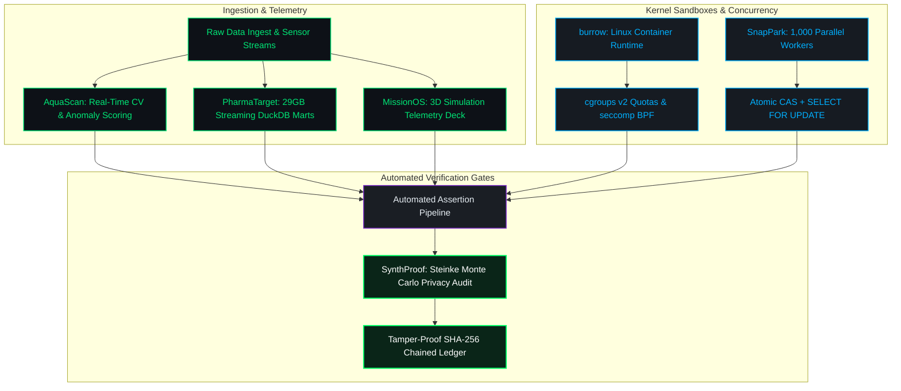

  <picture>
    <source media="(prefers-color-scheme: dark)" srcset="dark_mode.svg" />
    <source media="(prefers-color-scheme: light)" srcset="light_mode.svg" />
    
  </picture>

 

  
  &nbsp;
  
  &nbsp;
  

 

<!-- ==================== BENTO METRIC STATS ==================== -->

<table width="100%" border="0" cellspacing="8" cellpadding="0">
  <tr>
    <td width="25%" align="center" style="background:#0d1117; border:1px solid #30363d; border-radius:8px; padding:16px;">
      <h2 style="margin:0; color:#00E676;">1,164+</h2>
      
<b>AUTOMATED TESTS</b>

      140+ Test Suites across 12 Repos
    </td>
    <td width="25%" align="center" style="background:#0d1117; border:1px solid #30363d; border-radius:8px; padding:16px;">
      <h2 style="margin:0; color:#00B0FF;">108,000+</h2>
      
<b>LINES OF CODE</b>

      Python, Modern C++, Go, Java 21
    </td>
    <td width="25%" align="center" style="background:#0d1117; border:1px solid #30363d; border-radius:8px; padding:16px;">
      <h2 style="margin:0; color:#7928CA;">0 FAILS</h2>
      
<b>RACE CONDITIONS</b>

      CAS Atomic Locks & Memory Clean
    </td>
    <td width="25%" align="center" style="background:#0d1117; border:1px solid #30363d; border-radius:8px; padding:16px;">
      <h2 style="margin:0; color:#FF9100;">71 ms</h2>
      
<b>p95 QUERY LATENCY</b>

      80M CMS Rows in DuckDB Marts
    </td>
  </tr>
</table>

 

---

### 📐 Systems & Verification Topology

```mermaid
graph TD
  classDef source fill:#0D1117,stroke:#00E676,stroke-width:1.5px,color:#00E676;
  classDef sandbox fill:#161B22,stroke:#00B0FF,stroke-width:1.5px,color:#00B0FF;
  classDef engine fill:#1A1E24,stroke:#7928CA,stroke-width:1.5px,color:#E6EDF3;
  classDef verify fill:#0A2518,stroke:#00FF66,stroke-width:2px,color:#FFFFFF;

  subgraph Ingestion & Telemetry
    A[Raw Data Ingest & Sensor Streams]:::source --> B[AquaScan: Real-Time CV & Anomaly Scoring]:::source
    A --> C[PharmaTarget: 29GB Streaming DuckDB Marts]:::source
    A --> D[MissionOS: 3D Simulation Telemetry Deck]:::source
  end

  subgraph Kernel Sandboxes & Concurrency
    E[burrow: Linux Container Runtime]:::sandbox --> F[cgroups v2 Quotas & seccomp BPF]:::sandbox
    G[SnapPark: 1,000 Parallel Workers]:::sandbox --> H[Atomic CAS + SELECT FOR UPDATE]:::sandbox
  end

  subgraph Automated Verification Gates
    B --> I[Automated Assertion Pipeline]:::engine
    C --> I
    D --> I
    F --> I
    H --> I
    I --> J[SynthProof: Steinke Monte Carlo Privacy Audit]:::verify
    J --> K[Tamper-Proof SHA-256 Chained Ledger]:::verify
  end
```

---

### 🛡️ Flagship Systems Showcase

<table width="100%" border="0" cellspacing="10" cellpadding="0">
  <tr>
    <!-- Card 1: SynthProof -->
    <td width="50%" valign="top" style="background:#0d1117; border:1px solid #30363d; border-radius:10px; padding:20px;">
      <h3 style="margin-top:0; color:#00E676;">🔬 SynthProof</h3>
      
<b>Empirical AI Verification & Privacy Claims Gate</b>

      

        
        
        
      

       
      <ul style="color:#c9d1d9; font-size:13px; line-height:1.6; padding-left:18px;">
        <li><b>Monte Carlo Empirical Bounds:</b> Implemented Steinke membership-inference attack testing validating generative DP-SGD bounds $(\varepsilon, \delta)$ under empirical saturation.</li>
        <li><b>Automated Claims Gate:</b> Continuous test runner automatically rejects model checkpoints exhibiting statistical privacy leakage beyond theoretical thresholds.</li>
        <li><b>Cryptographic Proof Ledger:</b> Chained SHA-256 state hashes generate immutable verification certificates for every automated run.</li>
      </ul>
      

        <a href="https://github.com/rajmodi262/SynthProof"><b>Explore Verification Architecture ➔</b></a>
      

    </td>
    <!-- Card 2: SnapPark -->
    <td width="50%" valign="top" style="background:#0d1117; border:1px solid #30363d; border-radius:10px; padding:20px;">
      <h3 style="margin-top:0; color:#00B0FF;">⚡ SnapPark</h3>
      
<b>High-Concurrency Lock Contention & Stress Harness</b>

      

        
        
        
      

       
      <ul style="color:#c9d1d9; font-size:13px; line-height:1.6; padding-left:18px;">
        <li><b>Per-Slot Atomic CAS Manager:</b> Engineered fine-grained lock arbitration using <code>ConcurrentHashMap.putIfAbsent</code> paired with row-level database locks.</li>
        <li><b>Multi-Threaded Saturation Harness:</b> Formulated parallel stress tests with 1,000 competing virtual workers proving <b>0 double-booking anomalies</b> under saturation.</li>
        <li><b>Automated CI Gates:</b> Strict line and branch coverage thresholds verified on every push via GitHub Actions.</li>
      </ul>
      

        <a href="https://github.com/rajmodi262/SnapPark-Smart-Parking"><b>Explore Concurrency Harness ➔</b></a>
      

    </td>
  </tr>
  <tr>
    <!-- Card 3: burrow -->
    <td width="50%" valign="top" style="background:#0d1117; border:1px solid #30363d; border-radius:10px; padding:20px;">
      <h3 style="margin-top:0; color:#FF9100;">🐧 Burrow</h3>
      
<b>Linux Kernel Container Runtime & Sandbox Engine</b>

      

        
        
        
      

       
      <ul style="color:#c9d1d9; font-size:13px; line-height:1.6; padding-left:18px;">
        <li><b>Raw Kernel Isolation:</b> Built an educational OCI container runtime from scratch utilizing Linux PID, MOUNT, UTS, IPC, and NETWORK namespaces.</li>
        <li><b>Resource Quota Fuzzing:</b> Configured <code>cgroups v2</code> controllers for CPU quota enforcement and memory limits under synthetic resource exhaustion.</li>
        <li><b>Syscall Security Filtering:</b> Integrated <code>seccomp</code> BPF filters to intercept prohibited system calls at execution boundaries.</li>
      </ul>
      

        <a href="https://github.com/rajmodi262/burrow"><b>Explore Container Runtime ➔</b></a>
      

    </td>
    <!-- Card 4: AquaScan & MissionOS -->
    <td width="50%" valign="top" style="background:#0d1117; border:1px solid #30363d; border-radius:10px; padding:20px;">
      <h3 style="margin-top:0; color:#7928CA;">🤖 AquaScan & MissionOS</h3>
      
<b>Robotics Computer Vision & 3D Simulation Testing</b>

      

        
        
        
      

       
      <ul style="color:#c9d1d9; font-size:13px; line-height:1.6; padding-left:18px;">
        <li><b>Adaptive Sensor Degradation Scoring:</b> Multi-scale grid analyzer with adaptive Z-score outlier detection identifying optical occlusion under turbid noise.</li>
        <li><b>Real-Time Hybrid CV:</b> Combined deep YOLOv8 detection with classical LAB/HSV color-space segmentation for edge environments.</li>
        <li><b>Simulation Test Automation:</b> MissionOS interactive 2D/3D Canvas telemetry visualizer backed by automated Selenium E2E suites under IEEE 830 specs.</li>
      </ul>
      

        <a href="https://github.com/rajmodi262/AquaScan-Underwater-Trash-Detection"><b>Explore Robotics CV Engine ➔</b></a>
      

    </td>
  </tr>
</table>

---

### 🔬 Audited Repository Verification Matrix

| Repository | Domain & Architecture | Test Suites | Automated Tests | Source Scale | Formal Invariants & Guarantees |
| :--- | :--- | :---: | :---: | :---: | :--- |
| [`SynthProof`](https://github.com/rajmodi262/SynthProof) | **Empirical AI Privacy Verification** | **68** | **600+** | 120+ / ~25,000 | Steinke Monte Carlo empirical bounds, automated claims gate, SHA-256 ledger |
| [`pharmatarget`](https://github.com/rajmodi262/pharmatarget) | **High-Throughput Analytics (29GB Ingest)** | **11** | **166** | 65 / 11,000 | 80M row DuckDB SQL marts, quantile regression bootstrap CIs, 71ms p95 @ 1.38M |
| [`coldspend`](https://github.com/rajmodi262/coldspend) | **Physics-Based Digital Twin** | **10** | **112** | 38 / 4,091 | Thermodynamic kinetic drift models, regression discontinuity at alarm thresholds |
| [`verita`](https://github.com/rajmodi262/verita) | **Financial Compliance & Risk Scoring** | **20** | **106** | 136 / 31,160 | Real-time ML risk scoring, NLP pipelines, PostgreSQL + DuckDB SQL validation |
| [`agentforge`](https://github.com/rajmodi262/agentforge) | **Multi-Agent State Machine Planning** | **12** | **82** | 124 / 12,851 | LangGraph 7-agent state transitions, live WebSocket arbitration, Pydantic schemas |
| [`AquaScan`](https://github.com/rajmodi262/AquaScan-Underwater-Trash-Detection) | **Robotics CV & Sensor Anomaly Engine** | **3** | **45** | 38 / 5,520 | Hybrid YOLOv8 + Classical OpenCV, adaptive Z-score outlier detection |
| [`keystone`](https://github.com/rajmodi262/keystone) | **Change-Impact Blast-Radius Graph** | **7** | **25** | 62 / 4,386 | Conflict-aware RAG, topological change graph traversal, pgvector validation |
| [`SnapPark`](https://github.com/rajmodi262/SnapPark-Smart-Parking) | **Concurrent Lock Contention Engine** | **3** | **8** | 54 / 7,777 | Saturation-load concurrency tests, 0 double-booking anomalies, JUnit 5 + JaCoCo |
| [`procurement-risk`](https://github.com/rajmodi262/procurement-leadtime-risk-engine) | **Lead-Time Delay Prediction Engine** | **1** | **8** | 14 / 1,553 | DuckDB SQL OTIF/PPV/HHI analytics, XGBoost SHAP value stability |
| [`siop-hub`](https://github.com/rajmodi262/siop-inventory-optimization-hub) | **Multi-Plant Inventory Optimization** | **2** | **8** | 13 / 1,883 | Holt-Winters demand forecasting, dynamic safety stock variance |
| [`burrow`](https://github.com/rajmodi262/burrow) | **Linux Container Runtime (cgroups/seccomp)** | **2** | **4** | 12 / 1,251 | Namespace isolation, `cgroups v2` CPU/memory quota throttling, `seccomp` BPF |
| [`MissionOS`](https://github.com/rajmodi262/MissionOS-Systems-Engineering-Platform) | **Systems Lifecycle Simulation Platform** | **1** | **E2E** | 25 / 3,552 | Canvas 2D/3D physics rendering, Selenium automated regression suite |
| **TOTALS** | **Audited Systems Infrastructure** | **140+** | **1,164+** | **590+ / 108,000+** | **Zero Race Conditions • AddressSanitizer Clean • Deterministic CI/CD** |

---

### 🧰 Systems Toolchain & Technical Competencies

<table width="100%" border="0" cellspacing="4" cellpadding="8">
  <tr>
    <td width="25%" valign="top" style="background:#0d1117; border:1px solid #30363d; border-radius:6px;">
      <b style="color:#00E676;">Systems & Languages</b>  
      <code>Python 3.11+</code> 
      <code>Modern C++ (17/20)</code> 
      <code>Go</code> 
      <code>Java 21</code> 
      <code>Bash / Shell</code>
    </td>
    <td width="25%" valign="top" style="background:#0d1117; border:1px solid #30363d; border-radius:6px;">
      <b style="color:#00B0FF;">Testing & Verification</b>  
      <code>PyTest</code> 
      <code>JUnit 5</code> 
      <code>Selenium WebDriver</code> 
      <code>JaCoCo Coverage</code> 
      <code>AddressSanitizer</code>
    </td>
    <td width="25%" valign="top" style="background:#0d1117; border:1px solid #30363d; border-radius:6px;">
      <b style="color:#FF9100;">OS & Kernel Primitives</b>  
      <code>Linux (Ubuntu/RHEL)</code> 
      <code>cgroups v2 Quotas</code> 
      <code>seccomp BPF</code> 
      <code>Docker / OCI</code> 
      <code>WSL2</code>
    </td>
    <td width="25%" valign="top" style="background:#0d1117; border:1px solid #30363d; border-radius:6px;">
      <b style="color:#7928CA;">Compute, Vision & Data</b>  
      <code>OpenCV & YOLOv8</code> 
      <code>DuckDB (High-Throughput)</code> 
      <code>PostgreSQL</code> 
      <code>NumPy & SciPy</code> 
      <code>CUDA Concepts</code>
    </td>
  </tr>
</table>

 

---

  Engineered for deterministic correctness, performance, and reliability.
    
  
  &nbsp;
  
  &nbsp;
  

