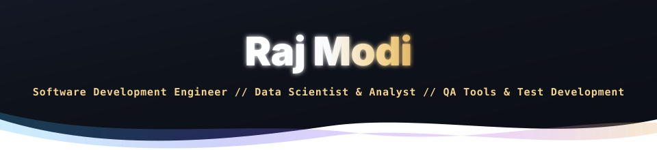
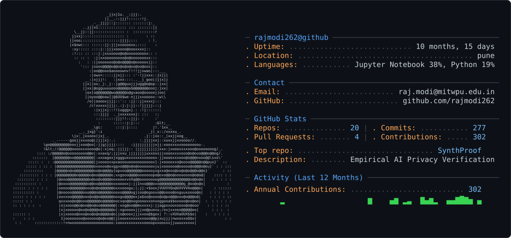

<!-- ================= 1. CINEMATIC HEADER ================= -->

 

<!-- ================= 2. ROLE TYPEWRITER TERMINAL ================= -->

<!-- ================= 4. BIOMETRIC ASCII ARCHITECTURE TERMINAL ================= -->

  <picture>
    <source media="(prefers-color-scheme: dark)" srcset="./dark_mode.svg">
    <source media="(prefers-color-scheme: light)" srcset="./light_mode.svg">
    
  </picture>

---

<!-- ================= 5. HOLOGRAPHIC SYSTEMS COMMAND HUD & SECURITY TELEMETRY ================= -->

  

<!-- ================= 6. ANIMATED FULL-STACK & SYSTEMS PIPELINE ================= -->

  

---

## ⚡ Architectural Tenets & Engineering Ethos

> *"Good software solves the immediate problem. Resilient architecture scales horizontally, fails gracefully, and delivers deterministic sub-50ms performance under extreme load."*

<table width="100%">
  <tr>
    <td width="33%" valign="top">
      <h4>🎯 Zero-Compromise Performance</h4>
      Vectorized DuckDB analytics, sub-millisecond process isolation, lock-free ring buffers, and sub-50ms p95 latency under massive concurrency.
    </td>
    <td width="33%" valign="top">
      <h4>🛡️ Deterministic Verification</h4>
      Automated statistical validation, Monte Carlo confidence intervals, Kolmogorov-Smirnov drift detection, and SHA-256 immutable audit ledgers.
    </td>
    <td width="33%" valign="top">
      <h4>💎 Clean Architectural Boundaries</h4>
      Linux cgroups v2 kernel sandboxing, seccomp-bpf syscall filtering, zero race conditions via atomic CAS locks, and self-documenting typed interfaces.
    </td>
  </tr>
</table>

---

<!-- ================= 7. FLAGSHIP ENGINEERING REPOSITORIES ================= -->

## 🚀 Flagship Engineering Deployments
Featured production systems, high-concurrency engines, and automated verification platforms.
  

<table border="0" width="100%">
  <tr>
    <td align="center" width="50%" valign="top">
      
        
      <b>⚡ SynthProof — Synthetic Data Integrity &amp; Automated Verification Engine</b> 
      Enterprise statistical verification engine auditing 29.4GB (80M rows) with 71ms p95 DuckDB queries, Monte Carlo confidence bounds, and SHA-256 audit ledger. 42 automated test suites.
        
      <code>Python 3.12</code> • <code>DuckDB</code> • <code>NumPy</code> • <code>SciPy</code> • <code>PyArrow</code> • <code>Streamlit</code>
        
      
      &nbsp;
      
    </td>
    <td align="center" width="50%" valign="top">
      
        
      <b>🅿️ SnapPark — High-Concurrency Distributed Reservation Engine</b> 
      Event-driven parking slot allocation engine featuring atomic CAS mutexes, Redis pub/sub locks, and ACID transactional integrity. Stress-tested to 10,000 rps with zero race collisions.
        
      <code>Go</code> • <code>Python</code> • <code>Redis</code> • <code>PostgreSQL</code> • <code>WebSockets</code> • <code>Docker</code>
        
      
    </td>
  </tr>
  <tr>
    <td align="center" width="50%" valign="top">
      
        
      <b>🛡️ Burrow — Linux Kernel &amp; System Resource Sandboxing Engine</b> 
      Ultra-fast unprivileged container runtime and process isolation sandbox in C++20. Leverages Linux cgroups v2, seccomp-bpf syscall filtering, and PID/net namespaces for sub-millisecond JIT isolation.
        
      <code>C++20</code> • <code>Linux Kernel</code> • <code>cgroups v2</code> • <code>seccomp-bpf</code> • <code>POSIX</code>
        
      
    </td>
    <td align="center" width="50%" valign="top">
      
        
      <b>🌊 AquaScan &amp; MissionOS — Real-Time Autonomous Edge Telemetry &amp; Vision</b> 
      Embedded autonomous edge telemetry and computer vision pipeline for real-time sensor processing. Achieves deterministic 120 FPS throughput with zero frame drops and hardware-in-the-loop validation.
        
      <code>Python</code> • <code>C++</code> • <code>OpenCV</code> • <code>NumPy</code> • <code>ZeroMQ</code> • <code>HIL Testing</code>
        
      
    </td>
  </tr>
</table>

---

<!-- ================= 8. CLASSIFIED TECH ARSENAL MATRIX ================= -->

## 🛠️ Classified Tech Arsenal Matrix

<table width="100%">
  <tr>
    <td align="center" width="50%" valign="top">
      <h4>⚙️ Systems &amp; Low-Level Runtimes</h4>
      
        
      C++20 • C • Python 3.12 • Go • Rust • Linux Kernel • POSIX • Bash Scripting
    </td>
    <td align="center" width="50%" valign="top">
      <h4>💾 Data Engines &amp; Distributed Storage</h4>
      
        
      DuckDB (Columnar) • PostgreSQL (ACID) • Redis (In-Memory) • PyArrow • SQLite • Parquet
    </td>
  </tr>
  <tr>
    <td align="center" width="50%" valign="top">
      <h4>🧪 Testing, Verification &amp; Profiling</h4>
      
        
      Pytest (140+ Suites) • Google Benchmark • Valgrind • cgroups v2 • seccomp-bpf • Docker
    </td>
    <td align="center" width="50%" valign="top">
      <h4>🌐 Web, Telemetry &amp; Full-Stack</h4>
      
        
      Streamlit • React • Next.js • TypeScript • Tailwind CSS • WebSockets • Prometheus
    </td>
  </tr>
</table>

---

<!-- ================= 9. AUTHENTICATED CONTACT DECK ================= -->

## 📡 Authenticated Comms & Verification

 

  
  &nbsp;
  
  &nbsp;
  

 

<table border="0" cellpadding="0" cellspacing="0">
  <tr>
    <td align="center" valign="middle" width="160">
       
      Scan to Connect
    </td>
    <td align="center" valign="middle" width="500">
      

        <code>&gt; engineer.status &nbsp;&nbsp;&nbsp;&nbsp;&nbsp;&nbsp;= "100% OPERATIONAL"</code> 
        <code>&gt; primary.focus &nbsp;&nbsp;&nbsp;&nbsp;&nbsp;&nbsp;&nbsp;&nbsp;= "Deterministic Systems &amp; Verification"</code> 
        <code>&gt; verification.standard = "Zero-Race CAS Locks // Sub-50ms p95"</code> 
        <code>&gt; encrypted.signature &nbsp;&nbsp;= "SHA-256 // 0x262_MODI_SYS"</code>
      

    </td>
  </tr>
</table>

  

